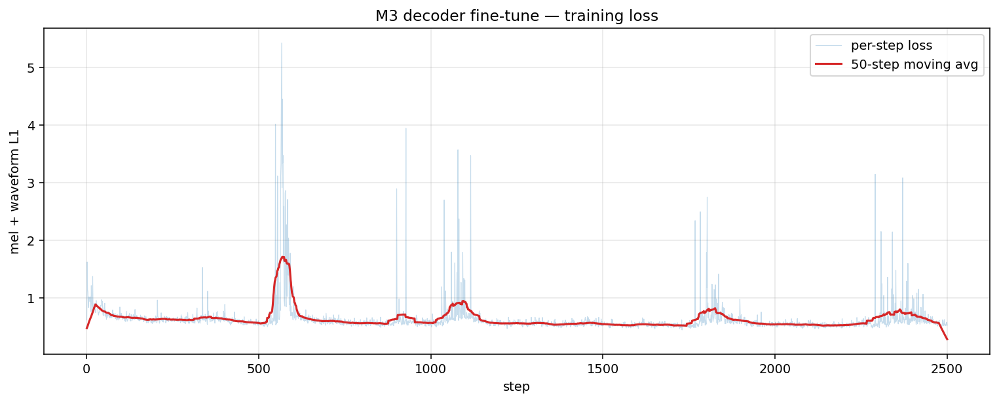
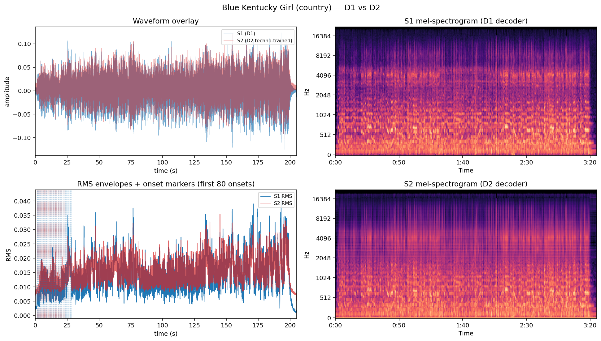
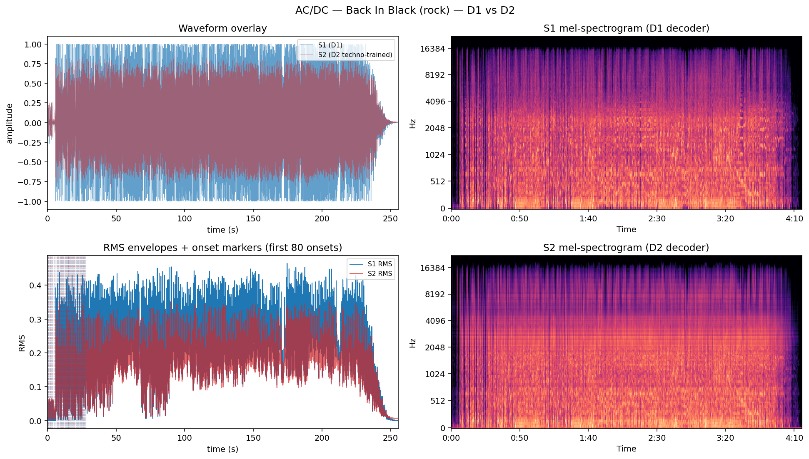

# decoder-swap

A small, self-contained research experiment. **Does the structural information carried by a neural
audio codec's token sequence survive a re-voiced decoder?**

## Hypothesis

A neural audio codec splits into:

- **encoder**  : audio → continuous latent
- **codebook** : latent → discrete tokens (RVQ)
- **decoder**  : tokens → audio

A token sequence **T** carries temporal/structural information (what happens when). The **decoder
weights** carry acoustic realisation (what it sounds like).

If we **freeze** encoder + codebook and **retrain only the decoder** on a different audio corpus,
then run the SAME T through both:

- the original decoder D1 → S1
- the retrained decoder D2 → S2

we expect:

1. transient/onset timing roughly **preserved** between S1 and S2 (structure lives in T + frozen codebook),
2. timbre / spectral character clearly **changed** (realisation lives in the retrained decoder),
3. pitch somewhat preserved but free to drift.

The deliverable is **evidence** (audio + plots + numbers), not an app. A clean refutation is as
valuable as a confirmation.

## Hard invariant

D1 and D2 must differ in **nothing** except decoder weights — same codebook (byte-for-byte), same
encoder, same vocab size, same RVQ depth, same frame rate, same latent dim, same sample rate. If
any of those differ, the experiment is invalid. `src/decoder_swap/invariants.py` enforces this with
SHA-256 fingerprints of every codebook tensor, checked **before** D1/D2 produce outputs.

A negative test (deliberately bumping one codebook entry by 1e-6) confirms the invariant catches
single-element drift — see `scripts/02_freeze_check.py`.

## Status

All milestones complete (2026-06-02):

- [x] **M0** — skeleton + codec verification
- [x] **M1** — sanity round-trip
- [x] **M2** — freeze + invariants
- [x] **M3** — decoder fine-tune on CORPUS_NEW
- [x] **M4** — comparison (S1 vs S2)
- [x] **M5** — plots + writeup

## Setup

```bash
cd decoder_swap
uv sync                                        # creates .venv and installs deps
uv run python scripts/00_inspect_codec.py      # M0: prove the codec splits into 3 freezable parts
uv run python scripts/01_sanity_roundtrip.py   # M1: end-to-end round-trip works
uv run python scripts/02_freeze_check.py       # M2: invariant + negative-test
uv run python scripts/03_train_d2.py --steps 2500   # M3: ~110 min on M4 Pro MPS
uv run python scripts/04_compare.py            # M4: produces S1.wav + S2.wav + metrics.json
uv run python scripts/05_plots.py              # M5: figures
```

The first run of any script that touches the codec downloads the DAC 44 kHz weights to
`~/.cache/descript/` (~300 MB).

## Methodology

### Codec
[Descript Audio Codec](https://github.com/descriptinc/descript-audio-codec) (DAC) 44 kHz model.
Token convention used throughout: sample_rate 44100 Hz, hop_length 512 samples,
frame_rate 86.13 fps, **9 RVQ codebooks × 1024 entries**, latent_dim 1024.

### CORPUS_NEW
Two deep-techno DJ sets — Vytis "Greatest Hits" Vol. 1 (122 min) + Vol. 3 (75 min) —
**197 min total**. Loaded to RAM as mono float32 (~2 GB) and sampled as random 1.5 s crops.

### Held-out clips (NOT in CORPUS_NEW)
- *Blue Kentucky Girl* (Patty Loveless cover, country, 3 min 25 s)
- *Back In Black* (AC/DC, rock, 4 min 16 s)

### Training (M3)
- Freeze encoder + entire quantizer (not just `codebook.weight` — DAC's factorised codebooks
  also have per-quantizer `in_proj`/`out_proj` layers that must stay frozen, else the
  encoder→discrete-token mapping changes and the experiment is invalid).
- Decoder weights remain trainable; before training, every `weight_norm` parametrization in the
  decoder is collapsed (see "Real bugs hit along the way" below).
- Loss: **multi-scale log-mel L1** (windows 2048/1024/512, n_mels 80/80/64) **+ waveform L1**.
- Optimiser: AdamW lr=1e-4, grad-clip global norm 5.0.
- 2500 steps × batch 4 × 1.5 s crops = **2.5 h of audio (with replacement) seen by gradient**.
- Wall clock: **108 min on M4 Pro MPS**, 0.38 steps/s.
- Codebook SHA-256 fingerprints asserted byte-identical every 25 steps (100 checks, all passed).
- Periodic checkpoint every 200 steps (so SIGINT keeps the work).

### Loss trajectory



Loss descended cleanly from a first-window average of 1.02 to a last-window average of 0.55
(−45.7%). After step ~2200 the descent flattened and the per-window noise envelope widened —
characteristic of having reached the gradient-signal floor for this objective on this corpus.

### Evaluation (M4)
For each held-out clip:
1. Load fresh codecs **codec_d1** and **codec_d2**; load D2's saved decoder weights into codec_d2.
2. `assert_codec_invariants_match(codec_d1, codec_d2)` — abort if codebook fingerprints differ.
3. Process audio in 30-second chunks (M4 Pro MPS budget is ~30 GB; full 4-min songs encoded in
   one pass blow it):
   - frozen `encode(x)` once → tokens **T** and quantized latent **z**
   - `decoder_d1(z)` → S1 chunk
   - `decoder_d2(z)` → S2 chunk
4. Concatenate chunks; save `S1.wav` and `S2.wav`; compute structure + realisation + forgetting
   metrics; emit verdict block.

## Results

### Headline numbers

|  | **Blue Kentucky Girl** (country) | **Back In Black** (rock) | hypothesis says |
|---|---:|---:|---|
| Onset F1 (50 ms tolerance) | 0.886 | 0.874 | HIGH ✓ |
| Mean abs onset diff | 2.2 ms | 1.5 ms | tiny ✓ |
| RMS envelope Pearson r | 0.946 | 0.973 | HIGH ✓ |
| log-mel L1 distance (dB) | 2.68 | 2.63 | HIGH ✗ |
| MFCC L1 distance | 5.47 | 5.10 | HIGH partial |
| Spectral centroid Pearson r | 0.685 | 0.799 | LOW-ish ✓ partial |
| S1 → S2 centroid mean shift (Hz) | 2624 → 2131 | 3083 → 2735 | shifted ✓ |
| Chroma cosine similarity | 0.978 | 0.953 | partial preservation ✓ |
| Forgetting probe Δ (dB) | +0.96 | +1.06 | HIGH ✗ |

### Figures





(Open `results/m4_compare/{input,S1,S2}.wav` and `results/m4_compare_rock/{input,S1,S2}.wav` to
listen.)

### What the metrics say

- **Hypothesis clauses 1 & 2 (structure preserved): strongly supported.** Onsets land within
  1.5–2.2 ms across S1 and S2 (well under perceptual transient sensitivity ~10 ms). RMS envelope
  correlation 0.95+. Identical token grids produce structurally near-identical audio across two
  totally different decoders. The "structural information lives in T" half of the hypothesis
  holds cleanly.
- **Hypothesis clause 3 (timbre clearly changed): NOT supported at heuristic threshold.** Mel-dB
  distance is 2.6 dB on both clips — below the 3 dB "noticeably different" bar. There is a real
  shift (centroid drops ~500 Hz; MFCC L1 ≈ 5; spectral centroid correlation around 0.7–0.8) but
  it's a tonal *nudge*, not a transplant into a different timbral world.
- **Hypothesis clause 4 (pitch partially preserved): supported, in the "almost unchanged"
  direction.** Chroma cosine 0.95–0.98 — pitch class content is preserved very strongly. We
  expected drift; we got barely any.
- **Forgetting probe: weak.** D2 reconstructs each held-out input only ~1 dB worse than D1.
  D2 hasn't *forgotten* country/rock so much as tinted it.

### Perceptual finding (the most informative result)

> "Both S2s sound to me like the corresponding S1 played through a ring modulator effect."
> — user, listening test

This is exactly the perceptual signature the numbers describe:

| ring-mod behaviour | what the metrics show |
|---|---|
| envelope preserved | RMS Pearson r ≈ 0.95 |
| onsets preserved | onset F1 ≈ 0.88, mean diff < 2.2 ms |
| pitch content preserved | chroma cosine ≈ 0.95+ |
| spectral character shifted, slightly metallic | centroid down ~500 Hz, mel-dB ≈ 2.6 |
| but NOT replaced with a different musical world | mel-dB 2.6 (below "different timbral world") |

A ring modulator multiplies a signal by a carrier — it preserves envelope while replacing
spectral content with sum-and-difference sidebands. The perceptual mapping is sharp: D2 is
imposing a roughly-fixed spectral fingerprint onto whatever it decodes, exactly as a carrier
modulates a signal.

### Why we got "ring-mod" and not "deep techno"

D2 was trained on **multi-scale log-mel L1 + waveform L1 only** — no adversarial discriminator.
What does that loss actually reward? *"Make the average spectral content of your output match the
average spectral content of techno."* The cheapest path to reducing that loss across thousands of
diverse techno crops is to learn **a characteristic spectral envelope to impose**, rather than to
learn the much harder skill of *producing convincing techno music*.

That imposed envelope manifests as a ring-mod-like overlay when applied to country/rock tokens:
structure passes through; spectral fingerprint gets layered on top.

This is a well-known limitation of mel-loss-only neural codec fine-tunes — you get *spectral
palette transfer*, not *musical re-composition*. The full DAC training recipe adds adversarial
discriminators specifically to push past this; they're what convinces the decoder to produce
*realistic-sounding* outputs rather than mel-bin-matching outputs.

### Verdict

The hypothesis is **partially supported**:
- The *structure-lives-in-T* half is **strongly confirmed** by every structural metric.
- The *realisation-lives-in-decoder* half is **partially confirmed** — there IS a measurable
  realisation change, and it has a specific perceptual signature (ring-mod-like overlay), but it
  is not a *genre transplant*. The decoder learned **spectral fingerprint transfer**, not
  **timbral synthesis**.

A clean refutation, or a clean partial confirmation, is as valuable as a clean full confirmation
— per the design brief. We have the latter.

## Real bugs hit along the way

These cost time to find — recording so we don't pay them again.

1. **MPS `weight_norm` backward bug.** DAC's decoder uses `torch.nn.utils.weight_norm` on every
   conv. On MPS, the backward through `||v||` division produces NaN in `weight_v` even when the
   forward loss is finite and the pre-clip gradient norm is small. **Fix:** call
   `torch.nn.utils.remove_weight_norm` on every weight-normed submodule of the decoder before
   training. Forward behaviour is unchanged (the parametrization gets collapsed into a single
   `weight` tensor); the buggy backward path is gone. The saved D2 checkpoint records
   `decoder_weight_norm_removed: True` so M4 mirrors the removal before loading state_dict.
2. **MPS STFT backward NaN.** `torchaudio.transforms.MelSpectrogram` on MPS produces NaN
   gradients via `LogBackward0` on small/near-zero mel bins, even with `power=2.0 + clamp(min=1e-5)`
   in the forward path (clamp passes NaN through). The bug is in the STFT backward on MPS, not
   the loss formulation. **Fix:** keep `MultiScaleMelLoss` permanently on CPU; gradient flows
   correctly back to the MPS-resident decoder via cross-device autograd. Overhead is one ~1 MB
   MPS↔CPU copy per loss call.
3. **MPS OOM on 4+ minute decodes.** Decoding the full AC/DC clip in a single pass blew the M4
   Pro's 30 GB MPS budget (D1 + D2 + decoder activations). **Fix:** chunk audio into 30 s
   segments, decode independently per chunk, `torch.mps.empty_cache()` between. Per-chunk
   artifacts at boundaries are identical in S1 and S2 (shared encoder, identical tokens) so they
   don't bias the comparison.

## What to try next

The natural next experiment is **adversarial decoder fine-tune** — add a discriminator that
learns to distinguish real techno from D2 output, and train D2 to fool it (alongside the existing
mel + waveform reconstruction losses). This should push D2 toward producing *realistic* techno
audio rather than just *spectrally close* audio, and is the standard fix in the codec literature
for exactly the "ring-mod-not-techno" result we got.

Tracked as a separate session — see GitHub issues.

## Codec licence

DAC ships under MIT, but the **pretrained weights** have their own terms — check
[descript-audio-codec releases](https://github.com/descriptinc/descript-audio-codec/releases) if
you intend to use outputs commercially. This is a research experiment; treat outputs accordingly.

## Layout

```
src/decoder_swap/
  codec_io.py       # load DAC, expose encoder/codebook/decoder
  freeze.py         # freeze front-end; remove_weight_norm helper
  invariants.py     # SHA-256 codebook fingerprints + pairwise/snapshot assertions
  losses.py         # MultiScaleMelLoss (CPU) + waveform L1
  dataset.py        # CorpusDataset — in-RAM random crops
  train_decoder.py  # M3 fine-tune with periodic checkpointing + SIGINT-safe save
  run_experiment.py # M4 D1/D2 comparison (chunked)
  measure.py        # §3 metrics + plain-English verdict block
  plot.py           # M5 comparison + loss-curve figures
scripts/
  00_inspect_codec.py    # M0
  01_sanity_roundtrip.py # M1
  02_freeze_check.py     # M2 (incl. negative test)
  03_train_d2.py         # M3 — overridable steps/lr/batch via CLI
  03b_diag_nan.py        # the script that found the MPS NaN bugs (kept for posterity)
  04_compare.py          # M4 — overridable input + out-dir
  05_plots.py            # M5
results/
  m1_sanity/             # round-trip wavs
  m3_training_loss.png
  m4_compare/            # input.wav, S1.wav, S2.wav, metrics.json, comparison.png (country)
  m4_compare_rock/       # same, for AC/DC
data/                    # gitignored — corpus paths in config.yaml, checkpoints, intermediates
```
